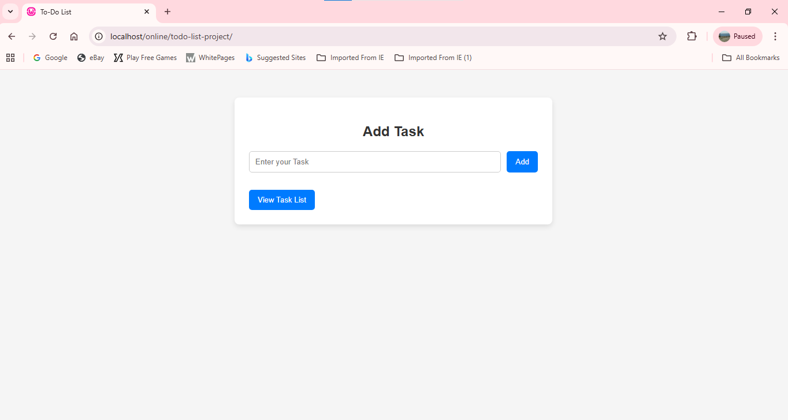
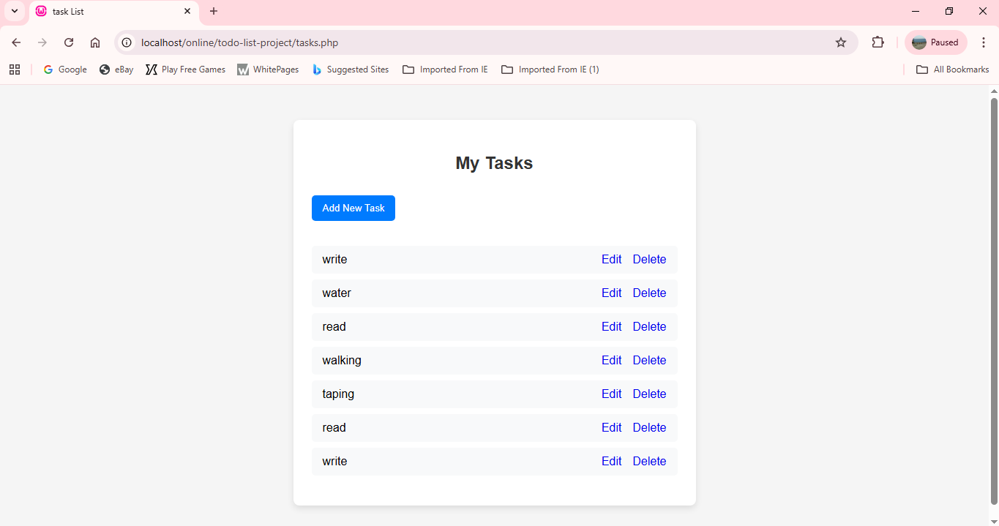

# 📝 To-Do List Web Application

A simple **Task Management Web Application** built using **PHP and MySQL**.
This application allows users to create, edit, view, and delete daily tasks easily.

---

## 📌 Features

* ➕ Add new tasks
* ✏️ Edit existing tasks
* 🗑️ Delete tasks
* 📋 View all tasks in a list
* 🎨 Simple and clean user interface

---

## 🛠️ Technologies Used

* **HTML**
* **CSS**
* **PHP**
* **MySQL**
* **WAMP Server**

---

## 📂 Project Structure

```
todo-list-project
│
├── index.php
├── add.php
├── edit.php
├── delete.php
├── list.php
├── style.css
├── README.md
└── images
    ├── home.png
    ├── task-list.png
    └── edit-task.png
```

---

## ⚙️ How to Run the Project

1. Install **WAMP Server**.
2. Start WAMP (icon should turn **green**).
3. Place the project folder inside:

```
C:\wamp64\www\
```

4. Open **phpMyAdmin**.

5. Create a database named:

```
todo_app
```

6. Create a table called **tasks**.

Example structure:

| Column      | Type         | Extra          |
| ----------- | ------------ | -------------- |
| id          | INT          | AUTO_INCREMENT |
| task        | VARCHAR(255) |                |
| PRIMARY KEY | id           |                |

7. Open your browser and run:

```
http://localhost/todo-list-project/
```

---

## 📸 Project Screenshots

### Home Page



### Task List Page



### Edit Task Page


---

## 🎯 Learning Outcome

Through this project I learned:

* CRUD operations using **PHP & MySQL**
* Database connection with **mysqli**
* Handling **GET and POST requests**
* Basic **Git & GitHub workflow**
* Running PHP projects using **WAMP**

---

## 👩‍💻 Author

**Shifa Parveen**

GitHub: [https://github.com/](https://github.com/)
